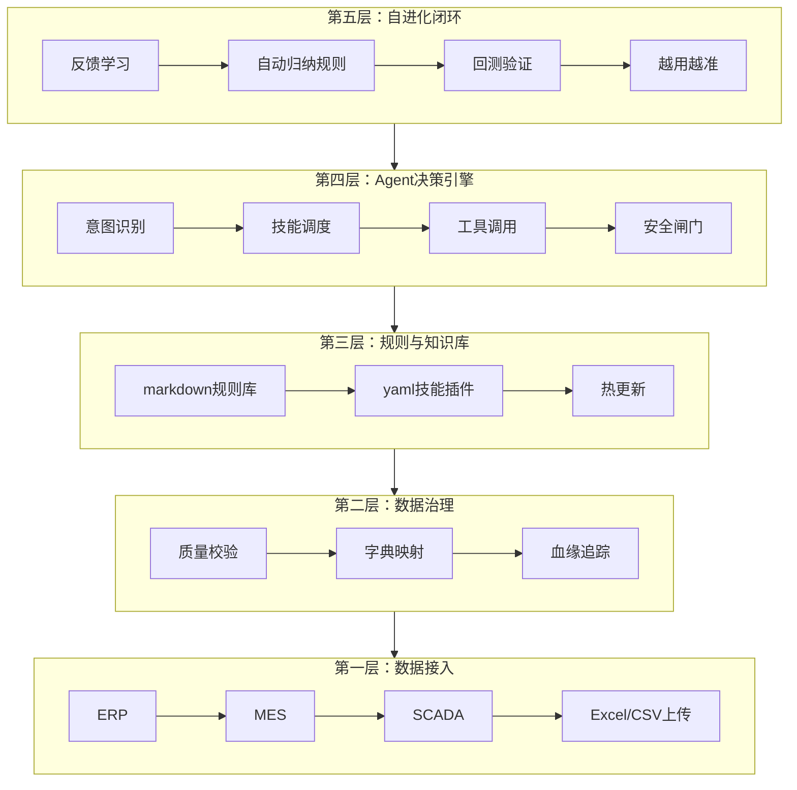
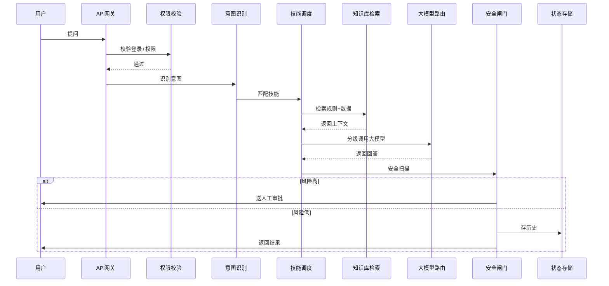
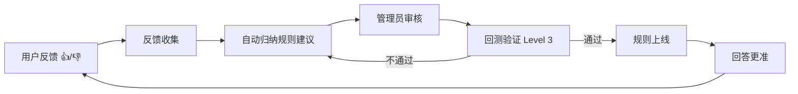
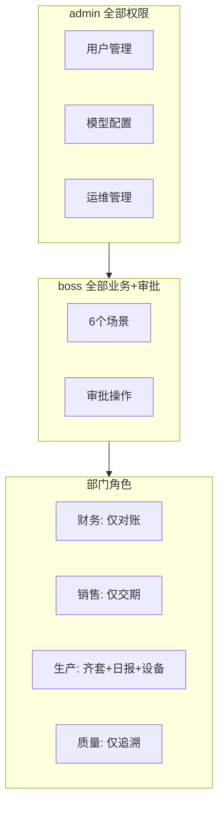

# 制造业AI Agent平台

工厂数字员工系统 —— 本地部署、内网可用、无需外网、越用越准。

## 📐 系统架构

### 整体五层架构



### 一次请求的完整流程



### 自进化闭环



### 权限模型



## ✨ 功能特性

### 核心能力（FDE五层架构）
- **数据接入层**：对接ERP/MES/SCADA，上传Excel/CSV即用
- **数据治理层**：质量校验 + 字典映射 + 血缘追踪
- **规则引擎层**：markdown规则库，热更新，不用改代码
- **Agent决策层**：意图识别 + 技能调用 + 人审闸门 + 安全扫描
- **自进化闭环**：反馈学习 → 自动归纳规则 → 回测验证 → 越用越准

### 6大业务场景
- 📊 **采购对账**：三单匹配、异常识别
- 📦 **交期答复**：自动查库存/产能，给准确交期
- 📋 **齐套检查**：物料齐套率、缺料预警
- 🔧 **设备维保**：设备状态看板、维保提醒
- 🔍 **质量追溯**：批次追溯、根因分析
- 📈 **管理日报**：厂长一眼看全厂KPI

### 权限与安全
- **6种角色**：管理员/厂长/财务/销售/生产/质量，数据隔离
- **消息通知过滤**：财务看不到设备报警，员工看不到待审批
- **登录失败锁定**：5次失败锁5分钟，防暴力破解
- **密码加密存储**：SHA256，不明文
- **操作审计日志**：所有操作留痕
- **越权防护**：所有接口需登录+角色校验

### 效率与成本
- **模型分级路由**：简单任务用轻量模型，复杂任务用重型模型，省token
- **本地部署**：内网可用，不用外网
- **离线运行**：大模型不接也能跑规则引擎

### 自进化系统（Level 1-4）
- **Level 1**：用户反馈统计（👍/👎）
- **Level 2**：自动规则归纳（系统自动从反馈找规律）
- **Level 3**：自动回测验证（改规则自动跑历史数据对比）
- **Level 4**：跨场景影响分析（改一个场景，看对其他场景影响）

### 运维管理
- **版本快照**：改配置前先拍快照，出问题一键回退
- **数据备份**：一键备份数据库
- **错误监控**：最近错误日志，哪个组件挂了一目了然
- **系统健康检查**：版本/运行时间/错误数

## 🛠️ 技术栈

- **后端**：FastAPI + Python
- **前端**：原生HTML + Tailwind CSS（本地版，无需外网）
- **数据库**：SQLite（演示）/ MySQL（生产）
- **大模型**：DeepSeek API（可选，不接也能跑规则引擎）

## 🚀 快速开始

### 1. 安装依赖

```bash
pip install -r requirements.txt
```

### 2. 启动服务

```bash
python -m uvicorn app_server:app --host 0.0.0.0 --port 8502
```

### 3. 访问

打开浏览器访问 http://localhost:8502

### 默认账号

| 角色 | 账号 | 密码 | 权限 |
|------|------|------|------|
| 管理员 | `admin` | `admin123` | 全部权限 |
| 厂长 | `boss` | `boss123` | 全部场景+审批 |
| 财务 | `finance` | `fin123` | 仅对账 |
| 销售 | `sales` | `sales123` | 仅交期 |
| 生产 | `prod` | `prod123` | 齐套+日报+设备 |
| 质量 | `qc` | `qc123` | 仅追溯 |

## 🔌 接入真实大模型

编辑 `config/llm.json`：

```json
{
  "enabled": true,
  "api_key": "你的DeepSeek API Key",
  "base_url": "https://api.deepseek.com",
  "models": {
    "light": "deepseek-chat",
    "standard": "deepseek-chat",
    "heavy": "deepseek-reasoner"
  }
}
```

## 📊 接入真实数据

### 方式一：上传Excel/CSV

进入「数据上传」页面，上传对应格式的数据文件。

### 方式二：对接ERP/MES

编辑 `core/data_connector.py`，把mock数据换成真实接口调用。

## 📁 目录结构

```
├── app_server.py          # FastAPI主入口
├── core/                  # 核心模块
│   ├── agent_engine.py    # Agent决策引擎
│   ├── data_connector.py  # 数据接入层
│   ├── state_store.py     # 状态/数据库层
│   ├── model_router.py    # 模型分级路由
│   ├── data_governance.py # 数据治理
│   ├── self_evolution.py  # 自进化闭环（Level 1-4）
│   ├── ops_manager.py     # 运维管理
│   └── llm_client.py      # 大模型客户端
├── config/                # 配置文件
├── vault/                 # 知识库
│   ├── rules/             # markdown规则文件
│   └── skills/            # yaml技能插件
├── static/                # 前端页面
├── data/                  # 数据文件
├── backups/               # 备份快照
└── fde_test/              # 自动化测试项目
```

## 🧪 测试

```bash
cd fde_test
python run_tests.py
```

覆盖：基础功能、故障模拟、高并发、边界情况、性能、恢复 六大类22个用例。

## 📄 License

MIT
