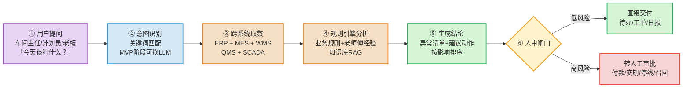
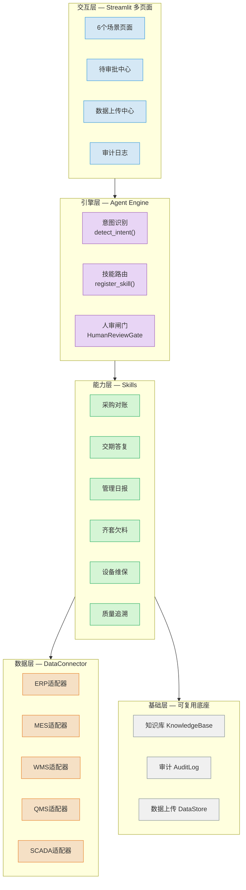
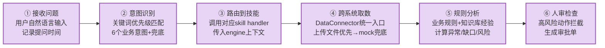
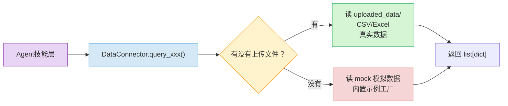
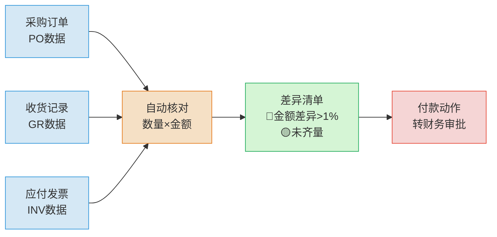
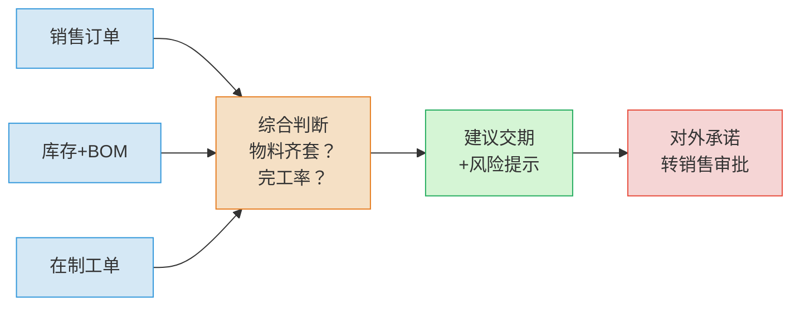
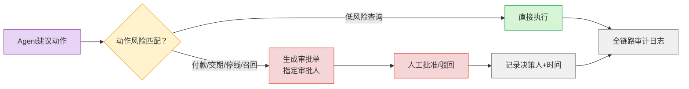
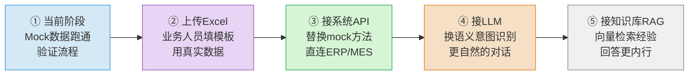

# 制造业 AI Agent 落地平台 —— 技术分享

> 不是一个聊天框，而是一套能在企业里真正干活的岗位级系统。
> 核心设计原则：**懂公司 · 能办事 · 管得住 · 持续变强**。

---

## 一、这个系统在解决什么问题

工厂里的数据散在 ERP、MES、WMS、QMS、SCADA 里，问一次要找很多人；异常靠老师傅判断，口径不统一；报表能看到结果，却看不到过程和原因。

这个系统做的事：**让 AI 跨系统取数、按业务规则处理、把结论送回岗位，高风险动作留给人拍板。**



---

## 二、系统分层架构



---

## 三、Agent 核心处理链路

每一个用户问题，都会走完以下 6 步：



**关键设计决策：**

| 设计点 | 做法 | 为什么 |
|--------|------|--------|
| 意图识别 | 关键词优先级匹配 | MVP零成本跑通，后续可无缝换LLM |
| 数据取数 | 上传文件 > mock数据 | 不用等真实系统，先跑流程再换数据 |
| 人审闸门 | 动作关键词匹配风险等级 | 高风险动作零漏网，低风险不卡流程 |
| 审计日志 | 每次ask独立session | 可回放、可审计、可追责 |
| 技能注册 | 装饰器式register_skill | 新增场景只加文件，不改引擎 |

---

## 四、数据层：统一入口，无缝切换

DataConnector 是所有数据的唯一入口。Agent 不直接碰底层系统，只调 `query_erp / query_mes / query_wms / query_qms / query_scada`。



**支持的 10 张数据表：**

| 表名 | 来源系统 | 用途 |
|------|---------|------|
| `ERP_orders` | ERP | 销售订单 |
| `ERP_inventory` | ERP | 库存余额 |
| `ERP_purchase_orders` | ERP | 采购订单 |
| `ERP_ap_invoices` | ERP | 应付发票 |
| `MES_work_orders` | MES | 生产工单 |
| `WMS_stock` | WMS | 仓库库存+在途 |
| `QMS_inspections` | QMS | 检验记录 |
| `QMS_defects` | QMS | 不良记录 |
| `PLM_bom` | PLM | BOM清单 |
| `SCADA_equipment` | SCADA | 设备台账 |

---

## 五、六大场景技术实现

### 场景1：采购三单匹配对账



**核心逻辑：** 三单金额交叉核对，差异 >1% 标红，未齐量标黄。付款动作触发人审。

### 场景2：销售交期答复



**核心逻辑：** 物料缺口→等料到货；完工率≥80%→按计划完工日；待投产→需排产确认。

### 场景3-6：生产侧场景

| 场景 | 核心计算 | 关键输入 | 输出 |
|------|---------|---------|------|
| 齐套欠料 | `需求=BOM用量×数量 - (库存+在途)` | BOM/库存/在途/工单 | 缺料清单+影响工单 |
| 设备维保 | 报警匹配+运行时长阈值 | SCADA设备数据 | 风险分级+维修建议 |
| 质量追溯 | 批次正反向关联 | 检验/不良/设备/班次 | 追溯路径+根因 |
| 管理日报 | 多源异常聚合排序 | 工单/质量/设备/库存 | 一页纸异常清单 |

---

## 六、人审与审计：为什么这是"管得住"的关键



**5类必须人审的动作（硬规则）：**

| 动作类型 | 审批人 | 对应场景 |
|---------|--------|---------|
| 对外承诺交期 | 销售负责人 | 交期答复 |
| 付款/折扣/退款 | 财务负责人 | 采购对账 |
| 停线/改排产/放行 | 生产负责人 | 齐套检查、设备维保 |
| 召回/判责/对外回复 | 质量负责人 | 质量追溯 |
| 越权访问/敏感审批 | 系统管理员 | 全局 |

---

## 七、从 Mock 到生产的落地路径



**第二步是最快见效的**：不需要改代码，在「数据上传」页面下载模板、填真实数据、上传即可。

**第三步的代码改动量**：只需改 `core/data_connector.py` 里的 `_load` 方法，把 `data_store.load_table()` 换成 API 调用，其他代码一行不动。

---

## 八、代码结构

```
E:\fde\
├── app.py                      # 主页（导航）
├── pages/                      # Streamlit多页面
│   ├── 1_💰_采购对账.py
│   ├── 2_📦_交期答复.py
│   ├── 3_📊_管理日报.py
│   ├── 4_📋_齐套检查.py
│   ├── 5_🔧_设备维保.py
│   ├── 6_🔍_质量追溯.py
│   ├── 7_📋_待审批.py
│   ├── 8_📝_审计日志.py
│   └── 9_📁_数据上传.py
├── core/
│   ├── agent_engine.py         # Agent引擎：意图→路由→执行→人审
│   ├── data_connector.py       # 数据连接层：上传优先→mock兜底
│   ├── data_store.py           # 上传文件管理+模板下载
│   ├── knowledge_base.py       # 知识库：规则+老师傅经验
│   ├── human_review.py         # 人审闸门
│   ├── audit_log.py            # 审计日志
│   └── ui_helpers.py          # 共享UI组件
├── skills/                     # 6个场景技能（每个一个文件）
├── uploaded_data/              # 用户上传的CSV数据
├── audit/                      # 审计日志输出
└── docs/
    └── implementation_guide.md  # 5个项目落地手册
```

---

## 快速启动

```bash
# 启动Web界面（用anaconda Python）
C:\Users\22397\anaconda3\python.exe -m streamlit run app.py

# 或命令行验证6个场景
python test_demo.py
```

浏览器打开 `http://localhost:8501`。
