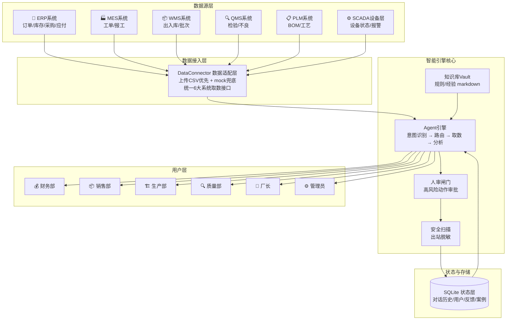
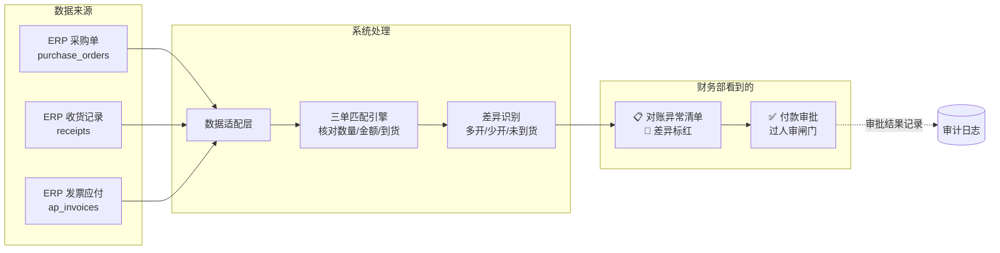
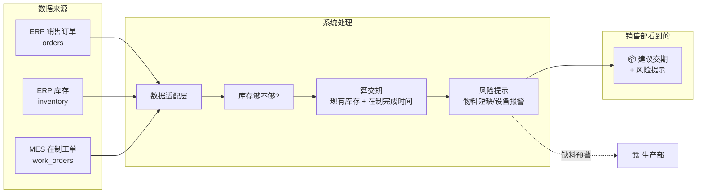
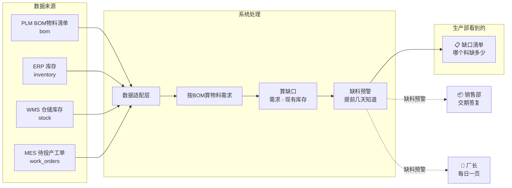
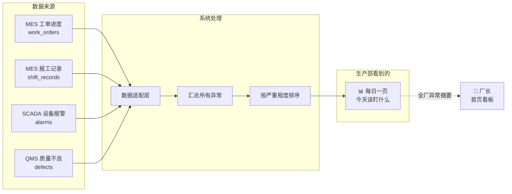
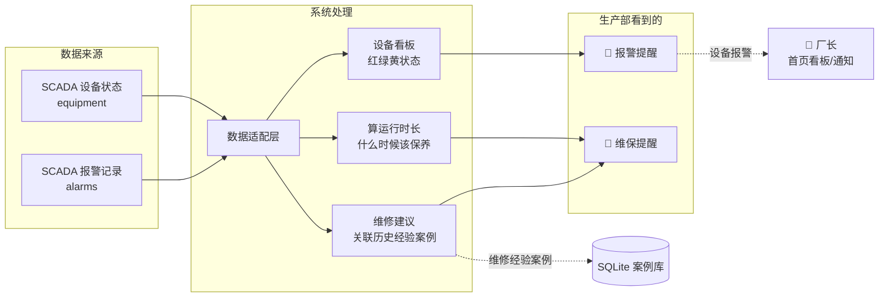
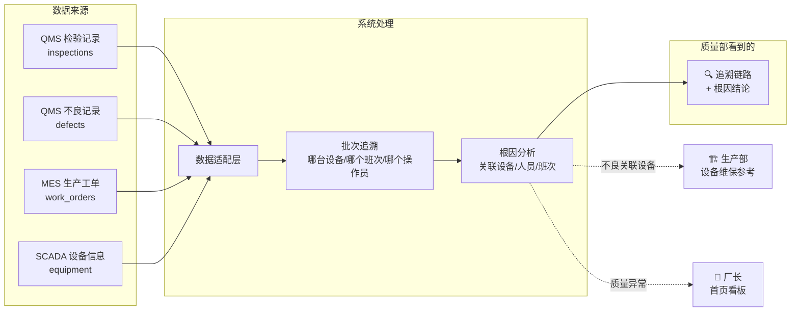
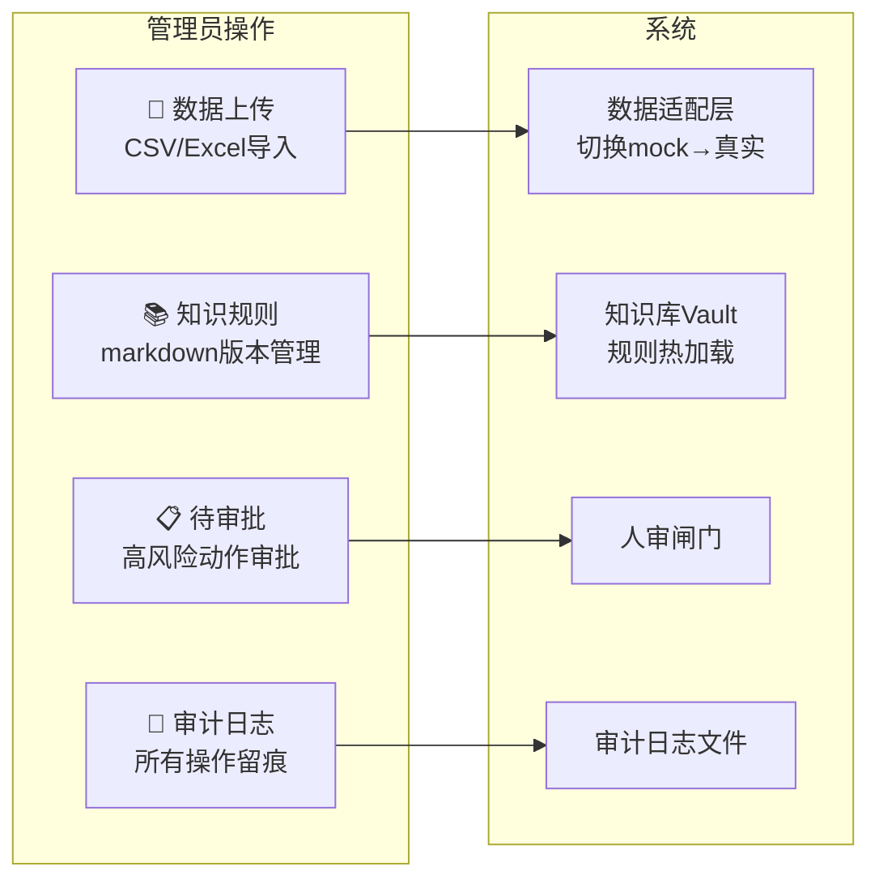
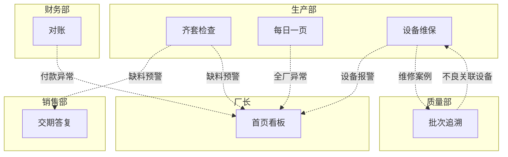

# 系统数据流动图

---

## 一、完整总览图（一张大图）



**一句话说清楚：** 6个业务系统的数据 → 经过适配层统一格式 → Agent引擎按规则分析（规则从知识库读）→ 高风险过人审 → 安全扫描 → 存SQLite → 6个部门按权限看自己的结果。

---

## 二、各部门数据流动图

### 财务部 —— 采购三单匹配对账



**财务部用户看到的：** 本月对账异常清单——哪些发票和收货对不上、哪些货还没到。不用翻Excel三单核对了。

---

### 销售部 —— 交期答复



**销售部用户看到的：** 客户问"这单什么时候能出？"，输入产品数量，5秒给出建议交期+风险提示。不用打电话问车间了。

**跨部门影响：** 如果有缺料风险，系统自动提示——这个信号也会流到生产部的齐套检查里。

---

### 生产部 —— 三个场景

#### 场景1：齐套欠料检查



#### 场景2：管理每日一页



#### 场景3：设备点检维保



**生产部用户看到的：** 三个页面——齐套检查看缺料、每日一页看全厂异常、设备看报警和维保。

**跨部门影响：** 设备报警自动流到厂长首页和通知，缺料预警流到销售部影响交期答复。

---

### 质量部 —— 质量批次追溯



**质量部用户看到的：** 客户投诉某批次有问题，输入批次号，系统自动追溯到是哪台设备、哪个班次、谁做的，根因是什么。

**跨部门影响：** 质量不良如果和设备有关，这个信号流到生产部的设备维保里——"这台设备做出来的东西老出问题"。

---

### 厂长 —— 首页总览

```mermaid
flowchart LR
    subgraph 所有部门汇总
        DASH[📊 首页看板<br/>全厂KPI一屏掌握]
    end

    subgraph 数据来源（全部汇总）
        ERP[ERP 订单/库存]
        MES[MES 工单/报工]
        SCADA[SCADA 设备]
        QMS[QMS 检验/不良]
    end

    subgraph 指标
        R1[订单完成率]
        R2[设备运行率/报警数]
        R3[质量合格率]
        R4[缺料预警数]
        R5[待审批数]
    end

    ERP --> DASH
    MES --> DASH
    SCADA --> DASH
    QMS --> DASH

    DASH --> R1
    DASH --> R2
    DASH --> R3
    DASH --> R4
    DASH --> R5

    DASH --> NOTIF[🔔 通知中心<br/>报警/审批/预警]
```

**厂长看到的：** 登录后一屏——订单完成率、设备运行率、质量合格率、缺料预警、待审批。5秒知道全厂今天状况。

---

### 管理员 —— 系统管理



**管理员看到的：** 系统管理四个页面——传数据、管规则、审流程、看日志。

---

## 三、跨部门数据流总结



**关键跨部门流动：**
- **生产→销售：** 缺料预警影响交期答复
- **生产→厂长：** 每日异常汇总到首页
- **质量→生产：** 不良关联设备，反哺设备维保
- **财务→厂长：** 对账异常上通知
